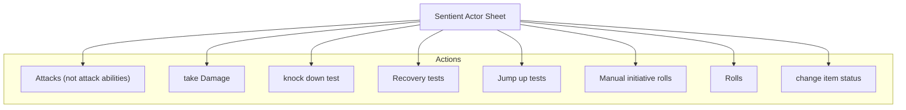

<Description>

{% include content from https://github.com/patrickmohrmann/earthdawn4eV2/blob/documentation-2/documentation/Functional%20Specification/actors.md#actor-sentienttemplate }

### Diagram

### Related User Functions

[UF_ActorSheetEdSentient-changeItemStatus](../User%20Functions/UF_ActorSheetEdSentient/UF_ActorSheetEdSentient-changeItemStatus.md)  
[UF_ActorSheetEdSentient-defaultOptions](../User%20Functions/UF_ActorSheetEdSentient/UF_ActorSheetEdSentient-defaultOptions.md)  
[UF_ActorSheetEdSentient-getSpellTabs](../User%20Functions/UF_ActorSheetEdSentient/UF_ActorSheetEdSentient-getSpellTabs.md)  
[UF_ActorSheetEdSentient-jumpUp](../User%20Functions/UF_ActorSheetEdSentient/UF_ActorSheetEdSentient-jumpUp.md)  
[UF_ActorSheetEdSentient-knockdownTest](../User%20Functions/UF_ActorSheetEdSentient/UF_ActorSheetEdSentient-knockdownTest.md)  
[UF_ActorSheetEdSentient-onAttack](../User%20Functions/UF_ActorSheetEdSentient/UF_ActorSheetEdSentient-onAttack.md)  
[UF_ActorSheetEdSentient-prepareContext](../User%20Functions/UF_ActorSheetEdSentient/UF_ActorSheetEdSentient-prepareContext.md)  
[UF_ActorSheetEdSentient-preparePartContext](../User%20Functions/UF_ActorSheetEdSentient/UF_ActorSheetEdSentient-preparePartContext.md)  
[UF_ActorSheetEdSentient-rollable](../User%20Functions/UF_ActorSheetEdSentient/UF_ActorSheetEdSentient-rollable.md)  
[UF_ActorSheetEdSentient-rollInitiative](../User%20Functions/UF_ActorSheetEdSentient/UF_ActorSheetEdSentient-rollInitiative.md)  
[UF_ActorSheetEdSentient-rollRecovery](../User%20Functions/UF_ActorSheetEdSentient/UF_ActorSheetEdSentient-rollRecovery.md)  
[UF_ActorSheetEdSentient-takeDamage](../User%20Functions/UF_ActorSheetEdSentient/UF_ActorSheetEdSentient-takeDamage.md)  

### Related Test Coverage

| Test Coverage | Related Documentation |
|---------------|-----------------------|
| Sentient Actor Sheet 1 - Spell Tabs | [[Test] - Sentient Actor Sheet 1 - Spell Tabs](https://github.com/patrickmohrmann/earthdawn4eV2/issues/1601) |
| Sentient Actor Sheet 2 - Manual Jump Up | [[Test] - Sentient Actor Sheet 2 - Manual Jump Up](https://github.com/patrickmohrmann/earthdawn4eV2/issues/1602) |
| Sentient Actor Sheet 3 - Manual knock down | [[Test] - Sentient Actor Sheet 3 - Manual knock down](https://github.com/patrickmohrmann/earthdawn4eV2/issues/1603) |
| Sentient Actor Sheet 4 - None-Ability attack actions | [[Test] - Sentient Actor Sheet 4 - None-Ability attack actions](https://github.com/patrickmohrmann/earthdawn4eV2/issues/1604) |
| Sentient Actor Sheet 5 - roll abilities | [[Test] - Sentient Actor Sheet 5 - roll abilities](https://github.com/patrickmohrmann/earthdawn4eV2/issues/1605) |
| Sentient Actor Sheet 6 - roll attributes | [[Test] - Sentient Actor Sheet 6 - roll attributes](https://github.com/patrickmohrmann/earthdawn4eV2/issues/1606) |
| Sentient Actor Sheet 7 - roll equipment | [[Test] - Sentient Actor Sheet 7 - roll equipment](https://github.com/patrickmohrmann/earthdawn4eV2/issues/1607) |
| Sentient Actor Sheet 8 - Manual initiative | [[Test] - Sentient Actor Sheet 8 - Manual initiative](https://github.com/patrickmohrmann/earthdawn4eV2/issues/1608) |
| Sentient Actor Sheet 9 - roll recovery | [[Test] - Sentient Actor Sheet 9 - roll recovery](https://github.com/patrickmohrmann/earthdawn4eV2/issues/1609) |
| Sentient Actor Sheet 10 - Manual take damage | [[Test] - Sentient Actor Sheet 10 - Manual take damage](https://github.com/patrickmohrmann/earthdawn4eV2/issues/1610) |

