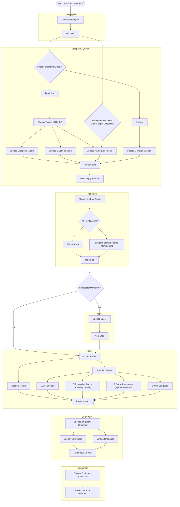

# Character Generation

<Description>
{% include content from "Functional Specification/character-generation.md}

### Diagram

### Related User Functions

[UF_CharacterGenerationPrompt--characterGeneration](../User%20Functions/UF_CharacterGenerationPrompt/UF_CharacterGenerationPrompt-characterGeneration.md)  
[UF_CharacterGenerationPrompt--activateTab](../User%20Functions/UF_CharacterGenerationPrompt/UF_CharacterGenerationPrompt-activateTab.md)  
[UF_CharacterGenerationPrompt--changeTab](../User%20Functions/UF_CharacterGenerationPrompt/UF_CharacterGenerationPrompt-changeTab.md)   
[UF_CharacterGenerationPrompt--constructor](../User%20Functions/UF_CharacterGenerationPrompt/UF_CharacterGenerationPrompt-constructor.md)  
[UF_CharacterGenerationPrompt--defaultOptions](../User%20Functions/UF_CharacterGenerationPrompt/UF_CharacterGenerationPrompt-defaultOptions.md)  
[UF_CharacterGenerationPrompt--displayValidationError](../User%20Functions/UF_CharacterGenerationPrompt/UF_CharacterGenerationPrompt-displayValidationError.md)  
[UF_CharacterGenerationPrompt--errorMessages](../User%20Functions/UF_CharacterGenerationPrompt/UF_CharacterGenerationPrompt-errorMessages.md)  
[UF_CharacterGenerationPrompt--finishGeneration](../User%20Functions/UF_CharacterGenerationPrompt/UF_CharacterGenerationPrompt-finishGeneration.md)  
[UF_CharacterGenerationPrompt--getEquipmentItems](../User%20Functions/UF_CharacterGenerationPrompt/UF_CharacterGenerationPrompt-getEquipmentItems.md)  
[UF_CharacterGenerationPrompt--nextTab](../User%20Functions/UF_CharacterGenerationPrompt/UF_CharacterGenerationPrompt-nextTab.md)  
[UF_CharacterGenerationPrompt--onChangeAttributeModifier](../User%20Functions/UF_CharacterGenerationPrompt/UF_CharacterGenerationPrompt-onChangeAttributeModifier.md)  
[UF_CharacterGenerationPrompt--onChangeRank](../User%20Functions/UF_CharacterGenerationPrompt/UF_CharacterGenerationPrompt-onChangeRank.md)  
[UF_CharacterGenerationPrompt--onClickSpell](../User%20Functions/UF_CharacterGenerationPrompt/UF_CharacterGenerationPrompt-onClickSpell.md)  
[UF_CharacterGenerationPrompt--onFormSubmission](../User%20Functions/UF_CharacterGenerationPrompt/UF_CharacterGenerationPrompt-onFormSubmission.md)  
[UF_CharacterGenerationPrompt--onReset](../User%20Functions/UF_CharacterGenerationPrompt/UF_CharacterGenerationPrompt-onReset.md)  
[UF_CharacterGenerationPrompt--onSelectEquipment](../User%20Functions/UF_CharacterGenerationPrompt/UF_CharacterGenerationPrompt-onSelectEquipment.md)  
[UF_CharacterGenerationPrompt--onSelectTalentOption](../User%20Functions/UF_CharacterGenerationPrompt/UF_CharacterGenerationPrompt-onSelectTalentOption.md)  
[UF_CharacterGenerationPrompt--parts](../User%20Functions/UF_CharacterGenerationPrompt/UF_CharacterGenerationPrompt-parts.md)  
[UF_CharacterGenerationPrompt--prepareContext](../User%20Functions/UF_CharacterGenerationPrompt/UF_CharacterGenerationPrompt-prepareContext.md)  
[UF_CharacterGenerationPrompt--preparePartContext](../User%20Functions/UF_CharacterGenerationPrompt/UF_CharacterGenerationPrompt-preparePartContext.md)  
[UF_CharacterGenerationPrompt--prepareTabsContext](../User%20Functions/UF_CharacterGenerationPrompt/UF_CharacterGenerationPrompt-prepareTabsContext.md)  
[UF_CharacterGenerationPrompt--previousTab](../User%20Functions/UF_CharacterGenerationPrompt/UF_CharacterGenerationPrompt-previousTab.md)  
[UF_CharacterGenerationPrompt--resetOptionalPoints](../User%20Functions/UF_CharacterGenerationPrompt/UF_CharacterGenerationPrompt-resetOptionalPoints.md)  
[UF_CharacterGenerationPrompt--tabs](../User%20Functions/UF_CharacterGenerationPrompt/UF_CharacterGenerationPrompt-tabs.md)  
[UF_CharacterGenerationPrompt--validateAttributes](../User%20Functions/UF_CharacterGenerationPrompt/UF_CharacterGenerationPrompt-validateAttributes.md)  
[UF_CharacterGenerationPrompt--validateClass](../User%20Functions/UF_CharacterGenerationPrompt/UF_CharacterGenerationPrompt-validateClass.md)  
[UF_CharacterGenerationPrompt--validateClassRanks](../User%20Functions/UF_CharacterGenerationPrompt/UF_CharacterGenerationPrompt-validateClassRanks.md)  
[UF_CharacterGenerationPrompt--validateCompletion](../User%20Functions/UF_CharacterGenerationPrompt/UF_CharacterGenerationPrompt-validateCompletion.md)  
[UF_CharacterGenerationPrompt--validateNamegiver](../User%20Functions/UF_CharacterGenerationPrompt/UF_CharacterGenerationPrompt-validateNamegiver.md)  
[UF_CharacterGenerationPrompt--validateSkills](../User%20Functions/UF_CharacterGenerationPrompt/UF_CharacterGenerationPrompt-validateSkills.md)  
[UF_CharacterGenerationPrompt--waitPrompt](../User%20Functions/UF_CharacterGenerationPrompt/UF_CharacterGenerationPrompt-waitPrompt.md) 
[UF_CharacterGenerationPrompt--hasNextStep](../User%20Functions/UF_CharacterGenerationPrompt/UF_CharacterGenerationPrompt-hasNextStep.md) 
[UF_CharacterGenerationPrompt--hasPreviousTab](../User%20Functions/UF_CharacterGenerationPrompt/UF_CharacterGenerationPrompt-hasPreviousTab.md) 

### Related Test Coverage

| Test Coverage | Related Documentation |
|---------------|-----------------------|
| Character Generation 1 - none Caster | [[Test] - Character Generation 1 - none Caster ](https://github.com/patrickmohrmann/earthdawn4eV2/issues/1549) |
| Character Generation 2 - Caster | [[Test] - Character Generation 2 - Caster](https://github.com/patrickmohrmann/earthdawn4eV2/issues/1550) |
| Character Generation 3 - Questor | [[Test] - Character Generation 3 - Questor](https://github.com/patrickmohrmann/earthdawn4eV2/issues/1551) |
| Character Generation 4 - Namegiver Talents | [[Test] - Character Generation 4 - Namegiver Talents](https://github.com/patrickmohrmann/earthdawn4eV2/issues/1552) |
| Character Generation 5 - Reset Options | [[Test] - Character Generation 5 - Reset Options ](https://github.com/patrickmohrmann/earthdawn4eV2/issues/1553) |
| Character Generation 6 - only minimum options | [[Test] - Character Generation 6 - only minimum options](https://github.com/patrickmohrmann/earthdawn4eV2/issues/1554) |

