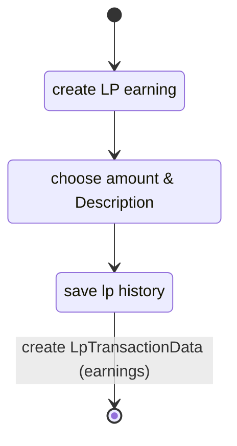

<Description>
it is possible to add Legend points to each actor manually by opening the legend point history and press the button to create an entry on the first tab (earnings). This will provide an entry with a prefilled date/time, an option for a description and a field for the amount. Saving the Legend point history will add this Legend point entry to the actor data and the legendpoints will be updated

### Diagram

### Related User Functions

[UF_LpTracking-addEarnings](../User%20Functions/UF_LpTracking/UF_LpTracking-addEarnings.md)

### Related Test Coverage

| Test Coverage | Related Documentation |
|---------------|-----------------------|
| Add Legend Points | [[Test] - add legend points manually](https://github.com/patrickmohrmann/earthdawn4eV2/issues/1317) |

