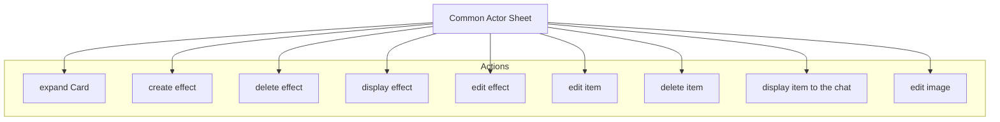

<Description>

### Diagram

### Related User Functions

[UF_ActorSheetEd-addSheetTabs](../User%20Functions/UF_ActorSheetEd/UF_ActorSheetEd-addSheetTabs.md)  
*[UF_ActorSheetEd-defaultOptions](../User%20Functions/UF_ActorSheetEd/UF_ActorSheetEd-defaultOptions.md)  
[UF_ActorSheetEd-onCardExpand](../User%20Functions/UF_ActorSheetEd/UF_ActorSheetEd-onCardExpand.md)  
?[UF_ActorSheetEd-onCreateChild](../User%20Functions/UF_ActorSheetEd/UF_ActorSheetEd-onCreateChild.md)  
?[UF_ActorSheetEd-onDeleteChild](../User%20Functions/UF_ActorSheetEd/UF_ActorSheetEd-onDeleteChild.md)  
?[UF_ActorSheetEd-onEditChild](../User%20Functions/UF_ActorSheetEd/UF_ActorSheetEd-onEditChild.md)  
[UF_ActorSheetEd-onDisplayChildToChat](../User%20Functions/UF_ActorSheetEd/UF_ActorSheetEd-onDisplayChildToChat.md)  
[UF_ActorSheetEd-onEditImage](../User%20Functions/UF_ActorSheetEd/UF_ActorSheetEd-onEditImage.md)  
[UF_ActorSheetEd-onitemEdit](../User%20Functions/UF_ActorSheetEd/UF_ActorSheetEd-onitemEdit.md)  
[UF_ActorSheetEd-onItemDelete](../User%20Functions/UF_ActorSheetEd/UF_ActorSheetEd-onItemDelete.md)  
[UF_ActorSheetEd-onDisplayItem](../User%20Functions/UF_ActorSheetEd/UF_ActorSheetEd-onDisplayItem.md)  
*[UF_ActorSheetEd-prepareContext](../User%20Functions/UF_ActorSheetEd/UF_ActorSheetEd-prepareContext.md)  
*[UF_ActorSheetEd-renderHTML](../User%20Functions/UF_ActorSheetEd/UF_ActorSheetEd-renderHTML.md)  
[UF_ActorSheetEd-tabOrderSheet](../User%20Functions/UF_ActorSheetEd/UF_ActorSheetEd-tabOrderSheet.md)  
*[UF_ActorSheetEd-tabs](../User%20Functions/UF_ActorSheetEd/UF_ActorSheetEd-tabs.md)  

### Related Test Coverage

| Test Coverage | Related Documentation |
|---------------|-----------------------|
| Common Actor Sheet 1 - Active Effects Controls | [[Test] - Common Actor Sheet 1 - ](https://github.com/patrickmohrmann/earthdawn4eV2/issues/1593) |
| Common Actor Sheet 2 - Item Controls | [[Test] - Common Actor Sheet 2 - ](https://github.com/patrickmohrmann/earthdawn4eV2/issues/1594) |
| Common Actor Sheet 3 - edit Image | [[Test] - Common Actor Sheet 3 - ](https://github.com/patrickmohrmann/earthdawn4eV2/issues/1595) |
| Common Actor Sheet 4 - expand Item | [[Test] - Common Actor Sheet 4 - ](https://github.com/patrickmohrmann/earthdawn4eV2/issues/1596) |

