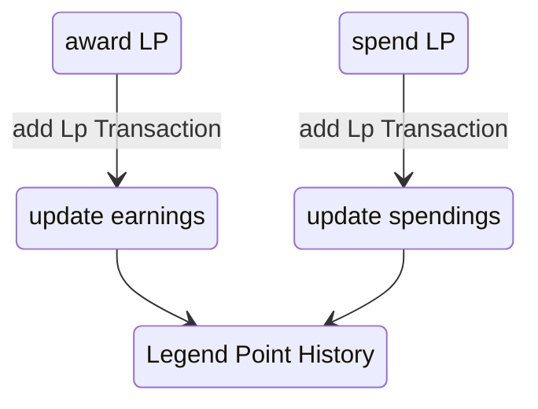

This use case covers the functionalities of the LP History. Three different tabs are available in the History prompt, showing an History of all earned legend Points, an overview of all the spendings and the third will list both (earnings and spendings) in a chronological order.  
- The first tab provides the option to assign additional legend poitns to the actor. 
- Entries might be manually edited.
<!-- - The chronological overview will provide an option to revert the legendpoints up to the selected point, with the option to only revert spendings, or earnings. -->

### Diagram

### Related User Functions

[UF_LpTracking-addLpTransaction](../User%20Functions/UF_LpTracking/UF_LpTracking-addLpTransaction.md)

[UF_LpTracking-legendpointHistory](../User%20Functions/UF_LpTracking/UF_LpTracking-legendpointHistory.md)

[UF_LpTracking-toggleTransactionDetails](../User%20Functions/UF_LpTracking/UF_LpTracking-toggleTransactionDetails.md)

<!-- [UF_LpTracking-revertLp](../User%20Functions/UF_LpTracking/UF_LpTracking-revertLp.md) -->

### Related Test Coverage

| Test Coverage | Related Documentation |
|---------------|-----------------------|
| Add Legend Points | [[Test] - add legend points manually](https://github.com/patrickmohrmann/earthdawn4eV2/issues/1317) |
| Add Legend Points via chat command | [[Test] - Add Legend Points via chat command](https://github.com/patrickmohrmann/earthdawn4eV2/issues/1318) |
| Edit and filter Legend Point entries | [[Test] - Edit and filter Legend Point entries](https://github.com/patrickmohrmann/earthdawn4eV2/issues/1325) |
<!-- | Revert Legend Points | [[Test] - revert Legend Points](https://github.com/patrickmohrmann/earthdawn4eV2/issues/XXX) | -->

 

