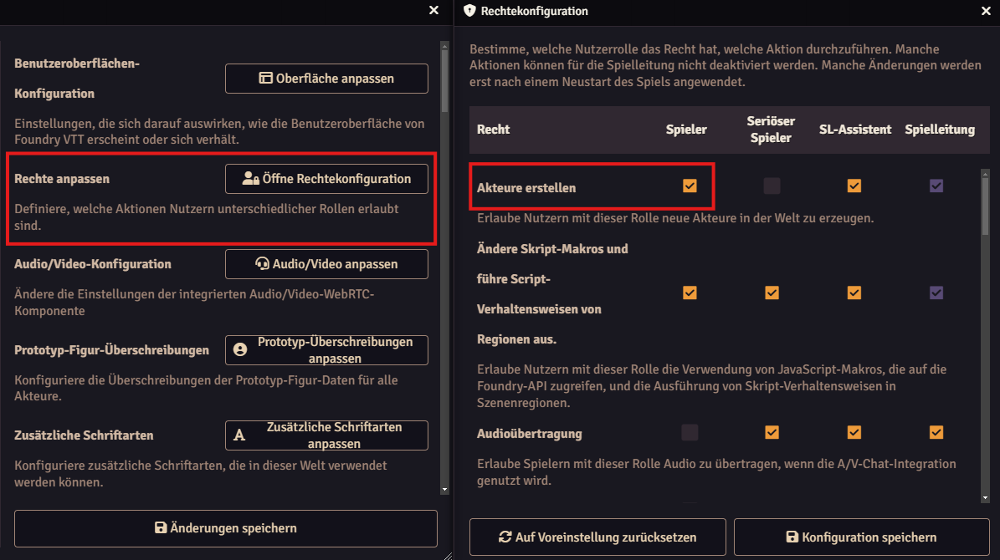
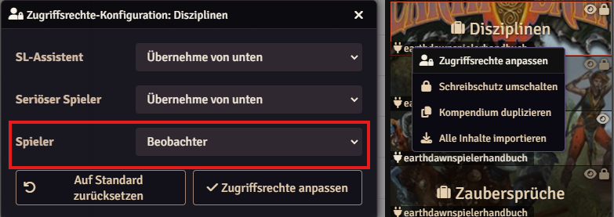
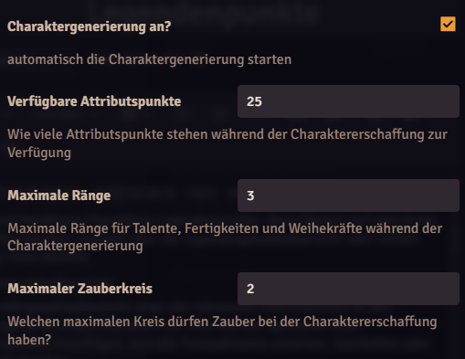

---
title: Charaktererschaffung
group: Deutsch
category: Charakter
---
Das Earthdawn System für Foundry VTT bietet eine umfangreiche Charaktererschaffung, um Spielenden einen schnellen Start ins Spiel zu ermöglichen.

Die Charaktererschaffung ist in mehrere Schritte aufgeteilt:

1. @UUID[JournalEntry.cZBJj7ZA2IF8vepy.JournalEntryPage.0XFXQ0pS0kkZlIi6#namensgeber]{Auswahl der Namensgeber}
2. @UUID[JournalEntry.cZBJj7ZA2IF8vepy.JournalEntryPage.0XFXQ0pS0kkZlIi6#berufung]{Auswahl der Berufung mit Verteilung der Talentränge}
3. @UUID[JournalEntry.cZBJj7ZA2IF8vepy.JournalEntryPage.0XFXQ0pS0kkZlIi6#attribute]{Verteilung der Attributspunkte}
4. @UUID[JournalEntry.cZBJj7ZA2IF8vepy.JournalEntryPage.0XFXQ0pS0kkZlIi6#zauber]{Auswahl der Zauber (Optional)}
5. @UUID[JournalEntry.cZBJj7ZA2IF8vepy.JournalEntryPage.0XFXQ0pS0kkZlIi6#fertigkeiten]{Verteilung der Fertigkeitsränge}
6. @UUID[JournalEntry.cZBJj7ZA2IF8vepy.JournalEntryPage.0XFXQ0pS0kkZlIi6#sprachen]{Auswahl der Sprachen}
7. @UUID[JournalEntry.cZBJj7ZA2IF8vepy.JournalEntryPage.0XFXQ0pS0kkZlIi6#ausrustung]{Auswahl der Startausrüstung}

## Voraussetzungen

Um einen Charakter im Earthdawn System zu erstellen, sind folgende Voraussetzungen zu beachten.

Zuerst benötigen Spielende das entsprechende Recht einen Akteur in der Welt anzulegen. Das kann standardmäßig nur die Spielleitung machen. Um das Recht an die Spielenden zu vergeben, öffne die User Permission Configuration (Nutzerverwaltung) in den Foundry VTT Systemeinstellungen und setze einen Haken bei Create Actor. Wenn die Spielleitung diese Option nicht für Spielende beibehalten möchte, sollte die Konfiguration nach der Charaktererschaffung wieder zurückgesetzt werden.

Vorsicht: Dieses Recht erlaubt es den Spielenden beliebig viele Akteure zu erstellen und besonders in öffentlichen Welten darf diese Berechtigung nicht leichtfertig aktiviert bleiben.

Die nächste wichtige Voraussetzung ist, dass die Spielenden Zugriff (mindestens "Beobachter" Zugriff) auf die entsprechenden Kompendium Pakete oder Items in der Welt haben. Damit ist gemeint, dass die automatische Charaktererschaffung nur funktioniert, wenn die Spielenden Zugriff auf die Items haben, die dafür benötigt werden (z.B. Namensgeber, Disziplinen, Talente, Fertigkeiten, Zauber etc.).

Wenn diese beiden Voraussetzungen erfüllt sind, können die Spielenden die Charaktererschaffung entweder über den Menüpunkt Akteur erstellen im Akteur Verzeichnis, oder über den Chat Befehl `/char` starten.

## Charaktererschaffung Konfiguration (Information für die Spielleitung)

Die Charaktererschaffung hat mehrere Systemeinstellungen die angepasst werden können:

### Charaktergenerierung an?

Diese Konfiguration ist standardmäßig aktiv. Dadurch wird jedesmal, wenn ein Akteur vom Typ Charakter erstellt wird, die Charaktererschaffung gestartet. Wenn diese Konfiguration deaktiviert wird, muss die Charaktererschaffung manuell über den Chat Befehl `/char` gestartet werden.

### Verfügbare Attributspunkte

Diese Einstellung legt fest, wie viele Attributspunkte bei der Charaktererschaffung zur Verfügung stehen. Standardmäßig sind es 25 Punkte, wie im Spielerhandbuch festgelegt.

### Maximale Ränge

Diese Einstellung legt fest, wie viele Ränge maximal auf Talente oder Fertigkeiten verteilt werden können. Standardmäßig ist der maximale Rang auf 3 festgelegt.

### Maximaler Zauberkreis

Diese Konfiguration legt fest, welche Zauber bei der Charaktererschaffung zur Verfügung stehen. Hier kann der Kreis festgelegt werden. Standardmäßig ist der maximale Kreis auf 2 festgelegt.

## Charaktererschaffung im Detail

Beim Starten öffnet sich ein Dialog, in dem die Charaktererschaffung stattfindet. Er besitzt am unteren Teil Buttons die durch die einzelnen Schritte führen. Der Button Fertigstellen wird erst aktiv, wenn alle nötigen Schritte der Charaktererschaffung abgeschlossen sind. Nach dem Klicken schließt sich der Dialog und der neue Akteur wird angelegt.

### Namensgeber

Im ersten Schritt wählst du die Namensgeber des Charakters aus einem Menü am unteren Teil des Dialoges aus.

### Berufung

Im zweiten Schritt wählst du zuerst die Berufungsart. Soll es Adept_in (standardmäßig voreingestellt) oder Questor_in werden? Du kannst zwischen den beiden Optionen wählen und bekommen entsprechend die Berufungsoptionen angezeigt (Disziplinen oder Questoren).

#### Disziplinen

Willst du Adpet_in werden, kannst du eine Disziplin auswählen. Diese haben alle Disziplin-, Optionale- und ggf. Freie-Talente. Du kannst dann Talentränge auf die Disziplintalente und ein optionales Talent verteilen.

##### Namensgebertalente

Einige Namensgeber besitzen eigene Talente (Menschen haben Vielseitigkeit und Windlinge haben Astralsicht). Diese Talente können zusätzlich zu den Disziplin- und Optionalen-Talenten mit Rängen versehen werden.

#### Questor_in

Wenn du ein_e Questor_in spielen willst, kannst du Liste der verfügbaren Optionen eine auswählen. Danach kannst du eine Weihekraft wählen und einen Rang auf die Weihekraft verteilen. Die Questor-Weihekraft wird nach der Charaktererschaffung automatisch angelegt und auf Rang 1 gesetzt.

### Attribute

Im dritten Schritt werden die Attributspunkte auf die Attribute verteilt. Die Verteilung erfolgt über die + & - Buttons jeweils neben dem Attribut. Das verändert auch automatisch die Charakteristiken des Charakters. Im unteren Teil des Dialoges wird sowohl der aktuelle Wert als auch der Charakteristikwert angezeigt der sich aus dem erhöhen oder senken des Attributs ergibt. Nicht verteilte Attributspunkte werden als Bonus-Karmapunkte gutgeschrieben.

### Zauber

Wenn du eine Disziplin gewählt hast, die Spruchzauber nutzt, werden hier die Zauber ausgewählt. Das geht über einfaches anklicken des jeweiligen Zaubers.

### Fertigkeiten

Im nächsten Schritt wählst du die Fertigkeiten des Charakters. Es muss mindestens ein Rang in ein Kunsthandwerk, 2 Ränge in Wissensfertigkeiten und 3 Ränge in Sprachfertigkeiten verteilt werden. Die Sprachfertigkeiten sind bereits vorausgewählt und können nur verbessert aber nicht reduziert oder entfernt werden. Zusätzlich stehen noch 8 freie Fertigkeitsränge für die freie Verteilung zur Verfügung.

Zum Verteilen der Ränge klickst du wie bei den anderen Schritten auf das + oder - Symbol neben der Fertigkeit.

### Sprachen

Im nächsten Schritt werden die Sprachen des Charakters bestimmt. Du kannst dabei so viele Sprachen auswählen, wie du Ränge in der Fertigkeit Lesen und Schreiben und der Fertigkeit Fremdsprachen hast.

### Ausrüstung

Im letzten Schritt bekommst du die Grundausrüstung des Charakters. Das sind die Ausrüstungsgegenstände, die der Grundausrüstung aus dem Kapitel Charaktererschaffung aus dem Spielerhandbuch entsprechen. Zusätzliche Ausrüstung musst du nach der Charaktererschaffung selbst hinzufügen.

