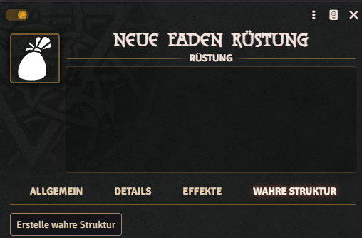
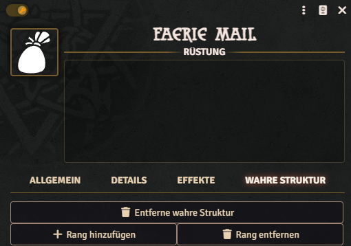
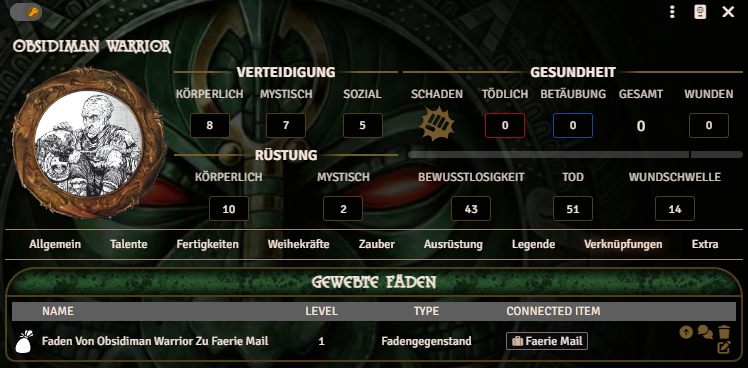

---
title: Fäden und Strukturen
group: Deutsch
category: Magie
---
In diesem Kapitel werden die Funktionsweisen von magischen Fäden – außerhalb der Spruchzauberei – behandelt.

## Strukturen

Das Earthdawn-System unterstützt aktuell Wahre Strukturen an Gegenständen und Akteuren. Wahre Strukturen können nur im Bearbeitungs-Modus erstellt werden. Für Akteure kannst du im Tab „Verbindungen“ eine wahre magische Struktur erzeugen. Bei Gegenständen (Ausrüstung, Rüstung, Schilde und Waffen) fügst du sie über den Tab „Wahre Struktur“ hinzu.

Wahre Strukturen von Gegenständen sind grundsätzlich für Spielende unsichtbar. Die Spielleitung hat die Möglichkeit, die Struktur auch für Spielende sichtbar zu machen. Über das kleine Auge-Symbol an der Wahren Struktur schaltest du die Sichtbarkeit aus oder ein. Für alle weiteren Funktionen muss die Wahre Struktur für die Spielenden sichtbar sein.

### Grundfunktionen von wahren Strukturen

Wahre Strukturen besitzen drei Grundfunktionen: Artefaktgeschichte, Forschen und Fadenweben. Dafür gibt es je einen Aktionsbutton im Spiel-Modus der entsprechenden Wahren Struktur. Die Funktionen sind aktuell nur dann automatisch unterstützt, wenn der Akteur selbst die entsprechenden Fähigkeiten (Artefaktgeschichte, Forschen und Fadenweben) besitzt.

Aktuell wird für Wahre Strukturen von Akteuren nur die Fadenweben-Funktion unterstützt.

#### Artefaktgeschichte

Mit der Artefaktgeschichte-Funktion können Spielende mit dem Talent Artefaktgeschichte die Struktur des Gegenstandes untersuchen. Dafür muss das entsprechende Talent die `ed-id` für item-history haben.

Bei einer erfolgreichen Probe wird die Anzahl der Ränge (als Tabs) im Gegenstand angezeigt. Pro Erfolg in der Artefaktgeschichte-Probe wird ein Rang der Wahren Struktur sichtbar. Ähnlich wie bei der Wahren Struktur selbst ist ein Teil des Ranges aber weiterhin für Spielende unsichtbar (siehe Forschen und Fadenweben).

#### Forschen

Noch nicht implementiert.

#### Fadenweben

Die Fadenweben-Funktion ermöglicht es Spielenden, einen Faden an die Wahre Struktur zu weben. Bei einer erfolgreichen Probe entsteht im Tab „Verknüpfungen“ ein Eintrag mit einem Link zum Ursprung des Fadens.

## Fadengegenstände

Fadengegenstände sind eine mögliche Form von Strukturgegenständen. Sie enthalten die üblichen Werte eines Strukturgegenständes:

- Mystische Verteidigung
- maximale Anzahl der Fäden
- Stufe
- Link zu den gewobenen Fäden

Die Ränge haben folgende Optionen:

- Schlüsselinformation-Frage
- Schlüsselinformation-Antwort
- Tat
- Effektbeschreibung
- Earthdawn Active Effect Link
- Fähigkeitslink

Wenn die Artefaktgeschichte-Probe erfolgreich war, werden entsprechend weitere Ränge freigeschaltet. Die Spielenden sehen hier erstmal nur die Frage der erforderlichen Schlüsselinformation.

Das Freischalten der Antwort und des Effekts, der Tat und der verlinkten Objekte ist nur durch die Spielleitung möglich.

Hinweis: Wie viele andere Funktionen im Earthdawn Foundry System stützt sich das System stark auf „Earthdawn Active Effects“. Aktuell ist die automatische Zuordnung der Effekte von Wahren Strukturen an die Akteure noch nicht implementiert. Spielleitung und Spielende müssen deshalb die Effekte manuell anlegen oder in der Wahren Struktur aktivieren.

### Fadenränge steigern

Nachdem ein Faden initial zu einem Gegenstand gewoben wurde, können die Fäden im Editier-Modus im Akteur einfach erhöht werden (siehe [Verbesserungen](../legend/advancements.md)).

## Gruppenstrukturen

Für eine Gruppenstruktur ist ein Gegenstand nötig, der als Fokus für die Fäden der Akteure dient. Erstelle dazu als Spielleitung einen Gegenstand in der Welt. Dann gib allen Spielenden „Besitzer/Owner-Rechte“ an diesem Gegenstand, damit sie Fäden zu diesem Gegenstand weben können. Der Gegenstand selbst bleibt in der Welt, kann aber auch jedem Charakter hinzugefügt werden.

Wahre Strukturen können auch durch die Spielleitung wieder entfernt werden. Mit dieser Aktion werden auch alle bisher erstellten Ränge gelöscht.

Wenn der Gegenstand in der Welt bleibt, können alle Charaktere die Fäden zum gleichen Gegenstand weben. Dadurch gibt es eine klare Übersicht und die Verbindung zur Gruppe ist sichtbar.

Der Gegenstand sollte eine Fadenanzahl von mindestens „Anzahl Spielende × 5“ besitzen. Das ist notwendig, damit jeder Akteur 5 Fäden zu der Wahren Struktur der Gruppe weben kann (entspricht den Regeln laut Regelwerk).

Gewobene Fäden sind im Tab „Verknüpfungen“ zu finden und können auch dort verbessert werden.

Ähnlich wie bei Fadengegenständen müssen hier Spielende und Spielleitung auch die Effekte selbst verwalten.

### Fadengegenstände

Viele Strukturgegenstände im Spiel sind Fadengegenstände mit mehreren Rängen. Die Anzahl der Ränge kann mit der Funktion „Rang hinzufügen“ oder „Rang entfernen“ angepasst werden. Es wird immer der nächsthöhere Rang hinzugefügt und immer der höchste Rang entfernt. Entfernte Ränge sind nicht wiederherstellbar.

