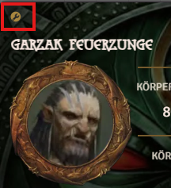
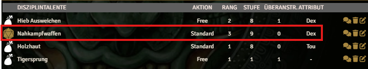
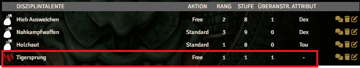
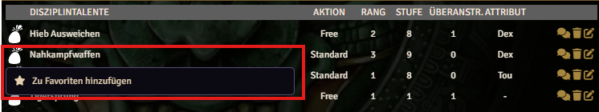

<!DOCTYPE html>
<html lang="en">
<head>
  <meta charset="UTF-8">
  <meta name="viewport" content="width=device-width, initial-scale=1.0">
  <title>Character Gameplay</title>
  <link rel="stylesheet" href="../wiki.css">
</head>
<body>
  <main>
    <section class="doc-card">
      <article class="doc-content">

The following section describes the individual functions of the character sheet in detail.

    <section style="overflow:hidden">
        <h3>Play and Edit Mode</h3>
        

            
            
The already described Play and Edit mode enables or disables features in many places. This protects users from unintended changes and creates a clear separation that makes the character sheet easier to read.

        

    </section>
    <h3>Features in Play Mode</h3>
    

        
In Play mode, various features are available in multiple places on the character sheet.

        <h4>+/- Button</h4>
        

            
The +/- buttons can increase or decrease values in many locations on the character sheet. Clicking edits a persistent effect (Active Effect) that stores all manual changes. Each additional click increases or decreases that effect.

            
A normal click increases or decreases by 1, and Shift+Click increases or decreases by 5.

            
Dice Button

            
Many abilities and items can be used to trigger an action roll. Items that can trigger an action show a die icon instead of the image when you hover over them.

            
            <h4>Blood Drop Button</h4>
            
Some abilities do not trigger an action roll but cause strain damage when used. Such abilities show a blood drop icon to trigger the action and apply damage.

            
        

        <h4>Spell Cards</h4>
        

            
Spell cards provide two functions: attuning a spell and casting the spell itself.

            
Attuning a spell opens a dedicated dialog where both quick attunement and full attunement can be performed.

            
Casting also opens a dialog where additional options such as weaving threads or using raw magic can be selected.

        

        
Add to Favorites

        

            
On the right side of the character sheet, there is a "Favorites" area. Players can add frequently used abilities there. A context menu, opened by right-clicking an item, allows adding the following types to favorites:

            <ul>
                <li>Talents</li>
                <li>Skills</li>
                <li>Devotion Powers</li>
                <li>Spells</li>
                <li>Powers</li>
                <li>Equipment (usable equipment only)</li>
            </ul>
            
            

            <h4>Action Buttons</h4>
            
There are many action buttons that trigger specific actions. Here are some examples:

            <h5>Favorites</h5>
            

                
Favorites always trigger an action. Talents, skills, devotion powers, and equipment roll directly. Spells start by asking whether they should be cast through a matrix, a grimoire, or raw.

            

            <h5>Legend Point Overview</h5>
            

                
The legend point overview opens a dialog showing all gained and spent legend points.

            

            <h5>Karma Ritual</h5>
            

                
The karma ritual button is located to the right of the header. Activating it resets current karma points to maximum.

            

            <h5>Recovery</h5>
            

                
The recovery icon (a small bed) next to the header opens a dialog to roll recovery tests or take a long rest.

            

            <h5>Initiative</h5>
            

                
The initiative icon (crossed swords) next to the header rolls the current initiative step.

            

            <h5>Knockdown</h5>
            

                
The knockdown button triggers a manual knockdown test.

            

            <h5>Stand Up</h5>
            

                
The stand-up button triggers a stand-up test.

            

            <h5>Take Damage</h5>
            

                
This button allows manually adding damage outside normal actions.

            

        

        <h4>Add Effect</h4>
        

            
Temporary and permanent effects include a "+" icon next to the header. Clicking it creates a new effect and adds it to the player character. A dialog opens to configure the effect.

        

        <h4>Situational Modifiers</h4>
        

            
In the "Specials" tab, situational modifiers are shown next to effects. Activating a button adds a temporary effect. Activating it again removes that effect. Active buttons appear darker.

            
The "Overwhelmed" effect is an exception because it can have multiple levels. Instead of a button, it uses an input field for the level.

        

        <h4>Equipment Status</h4>
        

            
All equipment items can have different statuses (for example, "Owned", "Worn", "Equipped", "Off-Hand", "Two-Handed"). Clicking the status icon cycles to the next status.

        

    

      </article>
    </section>
  </main>
</body>
</html>
