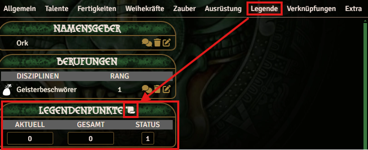
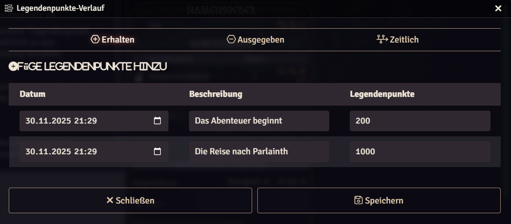
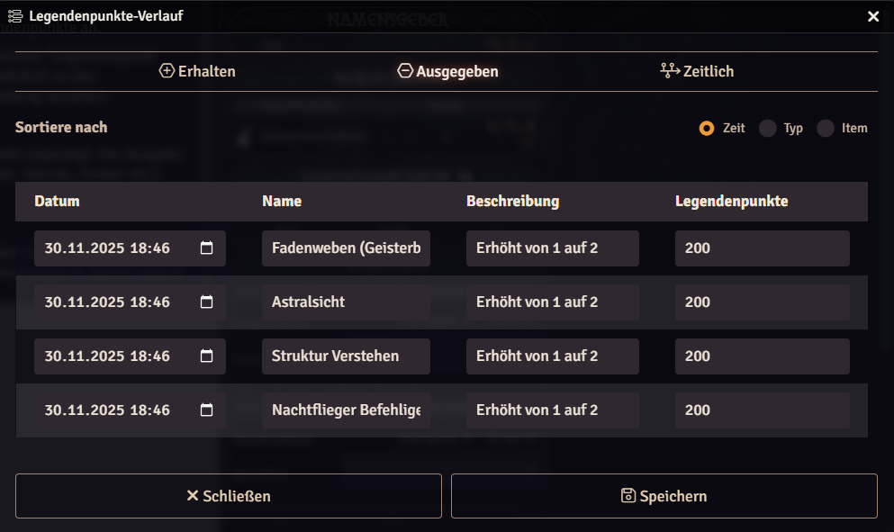
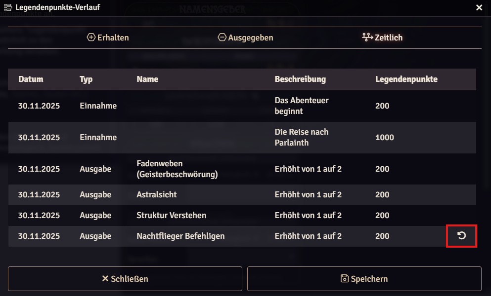
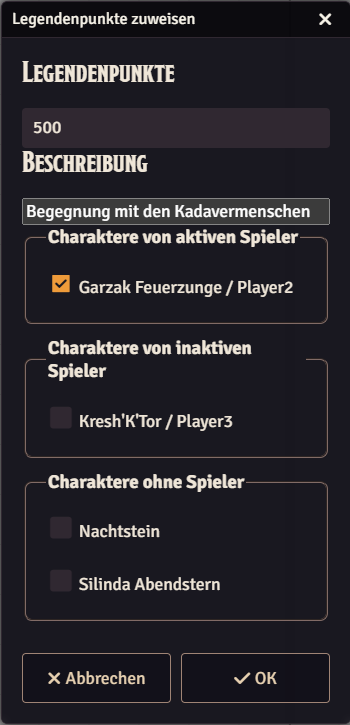
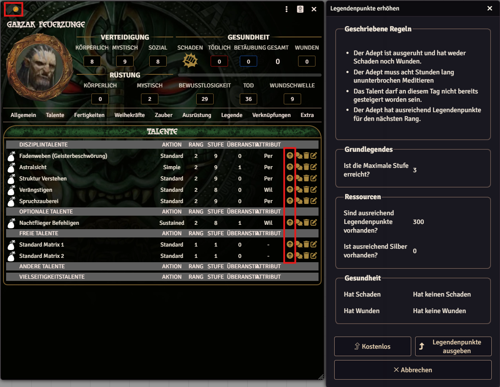
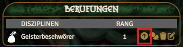

## Basics

Legend Points (LP) are a central element of the Earthdawn system and allow characters to improve their abilities.

The Earthdawn system for Foundry VTT provides extensive options for managing Legend Points.

## Character Legend Points

A character's Legend Points can be viewed in the "Legend" tab. It shows an overview of received, spent, and available Legend Points and their status.

## Earning Legend Points and History

To build their legend, characters need Legend Points. They can be added in two ways: manually through the Legend Point overview or through the `/lp` chat command.

### Legend Point Overview

The Legend Point overview shows all relevant information about a character's Legend Points. Players can add new Legend Points here and view, edit, or undo all transactions.

#### Received Legend Points

This view shows a list of all received Legend Points.

Newly earned Legend Points can be added with the "Add Legend Point" button. Every entry also includes a date and description in addition to the points.

#### Legend Point Spending

All Legend Point spending is shown in this view. Entries can be sorted by date, by name, or by type (attributes, talents, spells, etc.).

#### Chronological View & Reset

The last view combines the first two (received and spent Legend Points). It is strictly chronological, but each entry has an arrow icon. Clicking it deletes this entry and all newer entries.

Warning: At the moment, this function does not reset values tied to those transactions. It only deletes the entries from this list.

### /lp Chat Command

The other way to grant a character Legend Points is the `/lp` chat command. It opens a dialog showing all characters assigned to players (via configuration or access rights). The GM can run this command, select characters, and add Legend Points with a description. When the dialog is confirmed, each selected character receives a Legend Point entry with the given description.

## Spending Legend Points

Legend Points can be spent on the following items:

- Increase talent, skill, and devotion power ranks
- Increase attributes
- Learn spells
- Learn knacks (talent knacks, karma knacks, special maneuvers, and spell knacks)
- Permanent threads to patterns

The cost of each improvement varies by type according to the values in the Player's Guide. Key parameters, such as degree for abilities (Novice, Journeyman, Warden, or Master), always have a matching option in the item itself.

Abilities and attributes can be increased in Edit mode using the "arrow-up" button in the relevant list. Each time this button is pressed, a dialog appears with cost and requirement details.

Knacks and spells are dragged and dropped onto the character to trigger their learning function. Here as well, a dialog appears each time to explain the relevant conditions and options.

Permanent threads trigger the learning function when you activate the next thread rank.

## Disciplines, Paths, and Questors (Vocations)

Besides the options above for spending Legend Points, there are additional ways to improve a character. Raising Discipline circle, learning new Disciplines, joining a Path, or binding to a Passion as a Questor does not require Legend Points. For the associated talents, devotion powers, and knacks, the same rules as above apply.

All these vocations can be increased in Edit mode. Similar to abilities, a dialog appears here as well, informing you about conditions and options.

Paths and Questors have an ability directly tied to the vocation that must have at least a rank equal to the new rank of the Path or Questor. If this is not the case, the system offers the option to increase that ability immediately.

If a Discipline is increased, and it has a Thread Weaving talent used for spellcasting, another option appears to learn a new spell.

### Circle advancement with the all-talents house rule

The setting "Circle Advancement Talent Requirements" offers **All Talents for Circle Advancement (House Rule)**. This is an adjusted, tier-based version of the Player’s Guide optional rule **“Using All Talents To Advance”**. Refer to the Player’s Guide for the complete rule.

The house rule differs from the Player’s Guide rule in the following ways:

- Instead of one total number of talents, it requires separate minimum numbers for the Novice, Journeyman, Warden, and Master tiers.
- The tier requirements start at different Circles and are capped at a maximum number of talents.
- The tier counts only check whether the talents exist; they do not require the minimum talent rank from the Player’s Guide.

The requirement that one talent learned at the current Circle must be raised to the new Circle’s rank remains in effect. All talents associated with the Discipline are considered, including optional talents.
