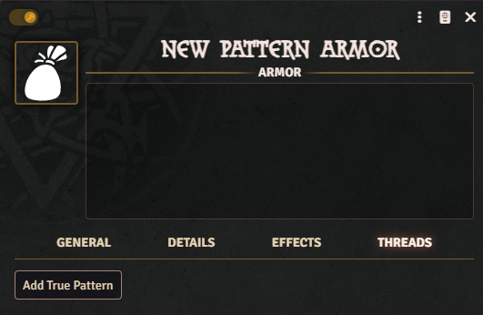
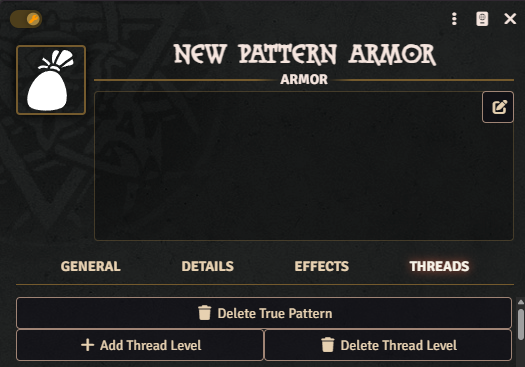
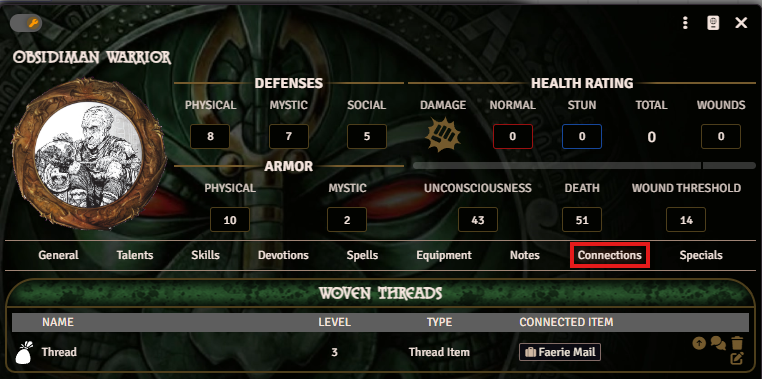

This chapter explains how magical threads work outside of spellcasting.

## Patterns

The Earthdawn system currently supports true patterns on items and actors. True patterns can only be created in Edit mode. For actors, you can create a true magical pattern in the "Connections" tab. For items (equipment, armor, shields, and weapons), add it via the "True Pattern" tab.

True patterns on items are hidden from players by default. The GM can choose to make the pattern visible to players. Use the small eye icon on the true pattern to toggle visibility. For all additional functions, the true pattern must be visible to players.

### Core Functions of True Patterns

True patterns have three core functions: Item History, Research, and Thread Weaving. There is one action button for each in the corresponding true pattern while in Play mode. These functions are currently supported automatically only if the actor itself has the required abilities (Item History, Research, and Thread Weaving).

For true patterns of actors, only Thread Weaving is currently supported.

#### Item History

The Item History function allows players with the Item History talent to investigate an item's pattern. For this, the corresponding talent must have the `ed-id` item-history.

On a successful test, the number of ranks (as tabs) becomes visible in the item. Each success in the Item History test reveals one rank of the true pattern.

Similar to the true pattern itself, part of each rank remains hidden from players (see Research and Thread Weaving).

#### Research

Not implemented yet.

#### Thread Weaving

The Thread Weaving function allows players to weave a thread to the true pattern. On a successful test, an entry is created in the "Links" tab with a link to the thread's origin.

## Thread Items

Thread items are one possible form of pattern items. They include the usual values of a pattern item:

- Mystic Defense
- Maximum number of threads
- Step
- Link to woven threads

Ranks have the following options:

- Key Knowledge question
- Key Knowledge answer
- Deed
- Effect description
- Earthdawn Active Effect link
- Ability link

If the Item History test was successful, additional ranks are unlocked accordingly. Players first see only the question for the required key knowledge.

Unlocking the answer and effect, the deed, and linked objects is only possible for the GM.

Note: Like many other functions in the Earthdawn Foundry system, this feature relies heavily on "Earthdawn Active Effects." Automatic assignment of effects from true patterns to actors is not implemented yet. Therefore, GM and players currently need to create effects manually or activate them in the true pattern.

## Increasing Thread Ranks

After a thread has been woven to an item initially, thread ranks can be increased directly on the actor in Edit mode (see [Advancements](../legend/advancements.md)).

## Group Patterns

A group pattern requires an item that serves as a focus for actor threads. As GM, create an item in the world. Then grant all players "Owner" rights on that item, so they can weave threads to it. The item itself stays in the world, but it can also be added to each character.

A True pattern can also be removed by a game master. This action also deletes all ranks created so far.

If the item remains in the world, all characters can weave threads to the same item. This creates a clear overview and keeps the group connection visible.

The item should have at least "number of players × 5" thread capacity. This is required so each actor can weave 5 threads to the group's true pattern (according to the rulebook).

Woven threads can be found in the "Connections" tab and can also be improved there.

Similar to thread items, players and GM must manage the effects themselves here as well.

### Thread items

Many thread items in the game have multiple ranks. The number of ranks can be adjusted using the "Add Rank" or "Remove Rank" functions. Adding a rank always adds the next higher rank, while removing a rank always removes the highest one. Removed rank cannot be restored.
